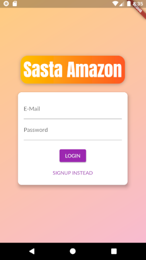
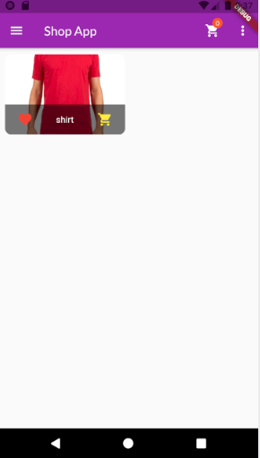
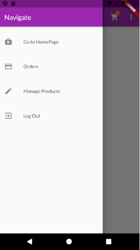
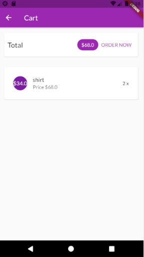

# state_apk

A new Flutter project. Basically, a app to store and edit products and make them available to all the users, which they can add to cart inividually and then order them, ordering makes that List of products to store on the database for retrieval.

## Getting Started

App makes use of Providers class in Flutter to stream all the data including the authorization, products detail, orders and cart.
All the data is stored in Firebase realtime database.

